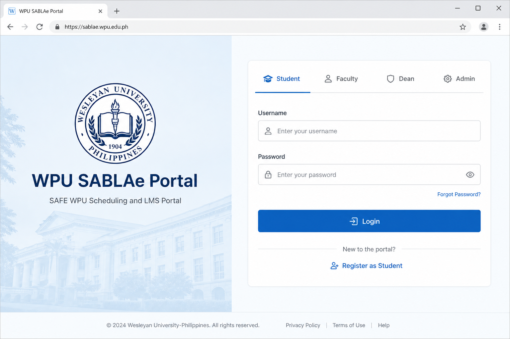
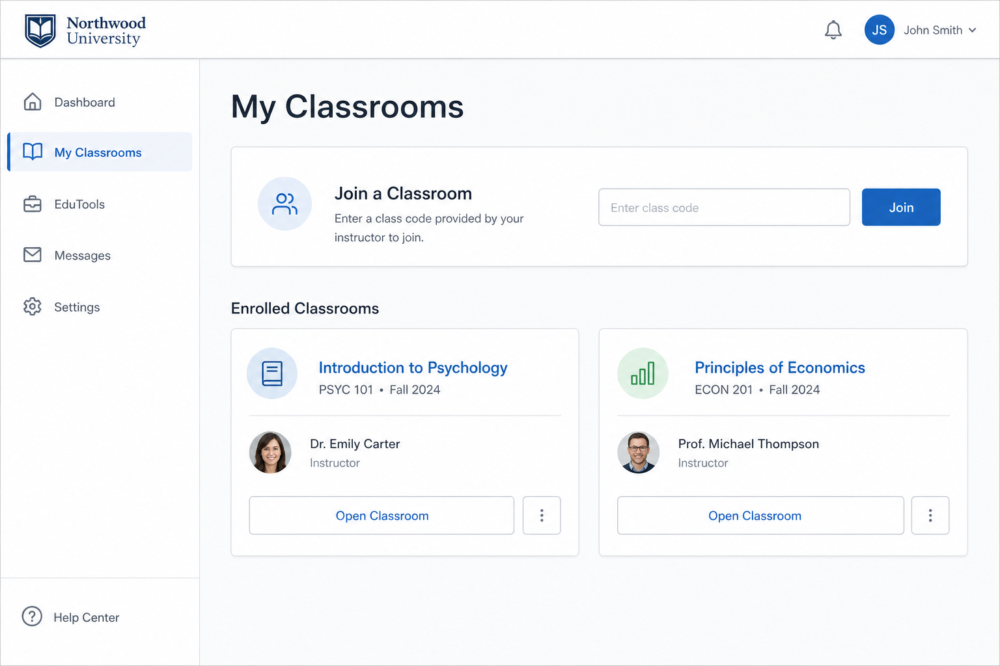
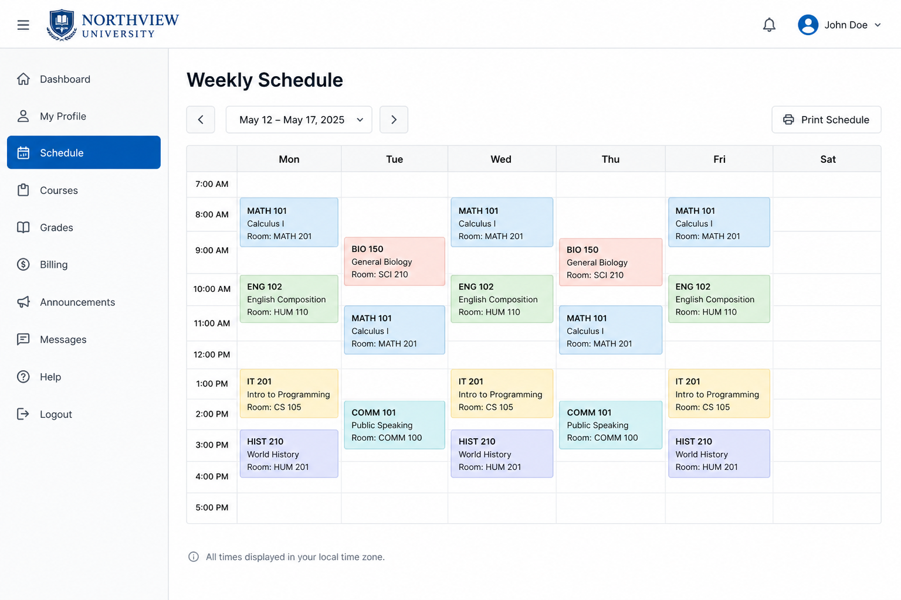
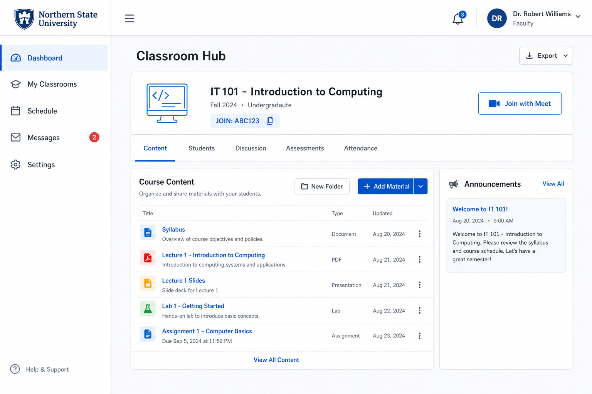
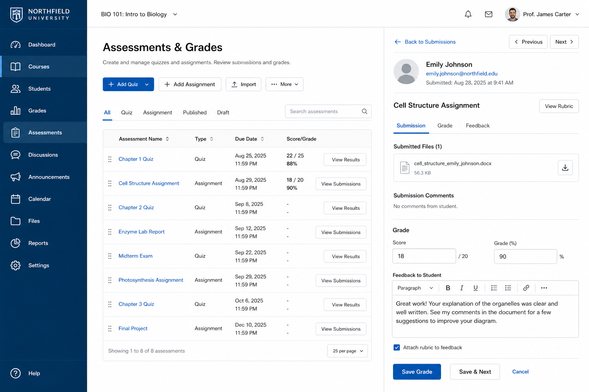
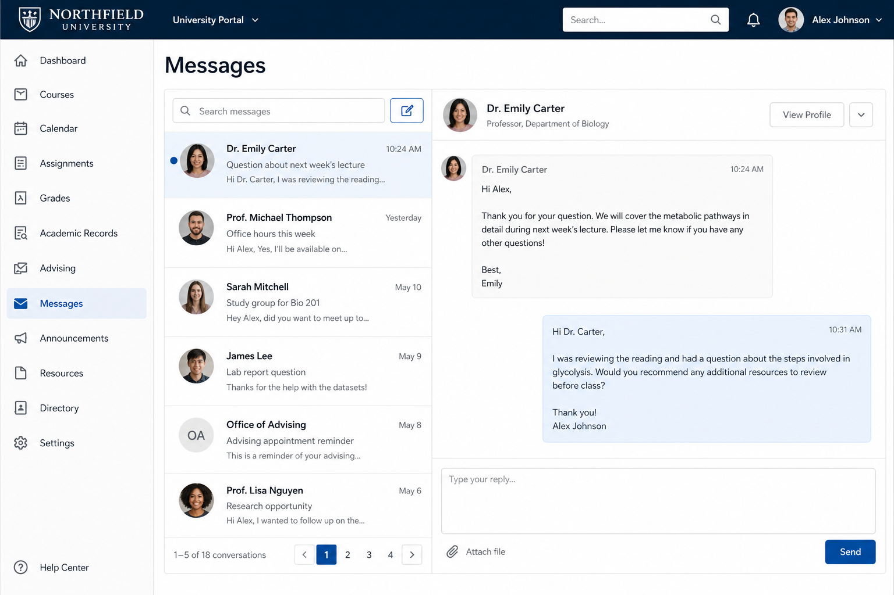

# WPU SABLAe Portal — User Manual

**SAFE WPU Scheduling and LMS Portal**  
Western Philippines University  
Version 1.0 — July 2026

---

## 1. Introduction

The **WPU SABLAe Portal** combines faculty scheduling, college administration, and an online classroom learning management system (LMS) in one web application.

Use this manual to learn how to sign in, manage schedules and classrooms, grade students, and use student learning tools.

### Who this manual is for

| Role | Typical users |
|------|----------------|
| Student | Enrolled learners |
| Faculty | Instructors teaching scheduled classes |
| Program Chair | Program-level academic managers |
| Dean | College-level academic managers |
| GEN ED | General Education coordinators |
| Admin | Institution administrators |
| Super Admin | System-wide account managers |

---

## 2. Getting Started

### 2.1 Open the portal

1. Open a web browser (Chrome, Edge, or Firefox recommended).
2. Go to the portal URL provided by your college (local example: `http://localhost/CLASS/`).
3. You will be redirected to the login page if you are not signed in.

### 2.2 Sign in

*Figure 1. Login page with role tabs*

**Steps**

1. On the login page, select the correct **role tab** (Student, Faculty, Dean, Program Chair, Admin, Super Admin, or Gen Ed).
2. Enter your **Username** and **Password**.
3. Click **Login**.
4. If prompted to change your password, update it on the Settings page before continuing.

> **Tip:** The role tab must match your account type. Logging in with the wrong tab will fail even if the password is correct.

### 2.3 Sign out

Click **Logout** in the navigation menu when you finish. Always sign out on shared computers.

### 2.4 Update your profile

Open **Settings** from the sidebar to:

- Change your password
- Update your display name or contact details (where allowed)
- Upload a profile photo

---

## 3. Student Guide

### 3.1 Register as a new student

If you do not yet have an account:

1. On the login page, open **Register** / **Register as Student**.
2. Fill in username, password, full name, email, student number, college, program, and year level.
3. Submit the form.
4. Wait for your **Dean** or **Program Chair** to approve the request.
5. After approval, sign in with the credentials you registered (or as instructed in the approval email).

### 3.2 Dashboard

After login, the **Dashboard** shows a quick overview of your enrolled classrooms and shortcuts to common tools.

### 3.3 Join and open classrooms

*Figure 2. Student My Classrooms page*

**Join with a code**

1. Go to **My Classrooms**.
2. Enter the **join code** given by your faculty.
3. Click **Join**.
4. Open the classroom from your enrolled list.

**Inside a classroom you can**

- Read announcements and weekly materials
- Download attachments
- Submit assignments and quizzes
- View scores
- Join discussion posts
- Open the Meet / live class link when provided

### 3.4 Assessments

1. Open a classroom.
2. Find the assessment (assignment, quiz, written work, or performance task).
3. Follow the instructions and submit before the due date.
4. Check your score after the faculty grades the work.

### 3.5 EduTools and wellness

From **EduTools** you can open:

- **Wellness Companion** — guided check-in / chat support
- **Offline reading packs** — download materials for offline study
- **Materials reviewer** and **Calculator** (when available)

### 3.6 Messages

Use **Messages** to contact faculty linked to your enrolled classes. Attach files when needed and keep messages professional.

---

## 4. Faculty Guide

### 4.1 My schedule

1. Open **My Schedule** or **Schedule**.
2. Review your weekly teaching assignments (day, time, room, course, section).
3. Use the weekly grid view for a calendar layout.

*Figure 3. Weekly schedule grid*

### 4.2 Online classrooms

*Figure 4. Faculty classroom hub*

1. Open **My Classrooms**.
2. Select a classroom linked to your schedule.
3. Share the **join code** with students.
4. Set or update the **Meet / live class link** in classroom settings.
5. Post content, announcements, and weekly materials from the classroom hub.

**Classroom hub tabs (typical)**

| Area | What you do |
|------|-------------|
| Content | Post materials, links, announcements |
| Students | View roster / enrollment |
| Discussion | Moderate class discussion |
| Assessments | Create and grade work |
| Attendance | Record present / absent |
| Settings | Title, Meet link, grade weights, syllabus |

### 4.3 Attendance

1. Open the classroom → **Attendance**.
2. Create or open a session for the class day.
3. Mark students present or absent (or review auto online attendance).
4. Save the session.

### 4.4 Assessments and grades

*Figure 5. Assessments and grading*

1. Open **Assessments** in the classroom.
2. Add a quiz, assignment, written work, or performance task.
3. Set due dates and instructions.
4. Review submissions and enter scores.
5. Adjust classroom **grade weights** in settings so totals match your syllabus.

### 4.5 Student list

Open **Student List** to see enrolled students per course and attendance summary totals.

### 4.6 Schedule change or makeup requests

If your schedule needs a change, submit a request from the faculty schedule tools. Your Dean or Program Chair reviews the request.

### 4.7 Messages and EduTools

- **Messages** — communicate with students and colleagues within portal rules.
- **EduTools** — shortcuts to teaching-related tools and classrooms.
- **Offline uploads** — prepare materials for student offline packs when available.

---

## 5. Program Chair Guide

Program Chairs manage academic operations for their assigned program(s).

### Common tasks

| Task | Where |
|------|--------|
| Manage faculty under the program | Faculty pages |
| Manage courses | Courses |
| Create / edit class schedules | Schedule / Add Schedule |
| View conflicts | Conflicts |
| Approve student registrations | Student Registrations |
| Monitor students | Students list |
| Teaching load | Teaching Load |
| Classrooms (if teaching) | My Classrooms |

### Approve student registration

1. Open **Student Registrations**.
2. Review pending requests (name, student number, program, year level).
3. Approve valid requests or reject incomplete / invalid ones.
4. Approved students can then sign in.

---

## 6. Dean Guide

Deans manage one college.

### Common tasks

| Task | Where |
|------|--------|
| Manage programs | Programs |
| Assign program chairs | Program Chairs |
| Manage faculty, courses, rooms | Faculty / Courses / Rooms |
| Build schedules (manual or auto) | Schedule / Auto Schedule |
| Resolve conflicts | Conflicts |
| Approve student registrations | Student Registrations |
| Reports and materials monitor | Reports / Materials Monitor |
| GEN ED coordination (college side) | GEN ED tools (as provided) |

### Scheduling tips

1. Ensure rooms, faculty, and courses exist before creating schedules.
2. Use conflict checking before saving.
3. Use **Auto Schedule** only when college data (rooms, faculty availability, offerings) is complete.
4. Share generated join codes / classroom access with faculty after schedules create online classrooms.

---

## 7. GEN ED Guide

GEN ED accounts manage institution-wide General Education offerings.

### Common tasks

- Maintain GE courses, faculty, and rooms
- Create GE schedules with program / year / section targets
- Assign GE offerings to colleges
- Monitor conflicts and reports for GE classes
- Manage GE classrooms when teaching assignments apply

---

## 8. Admin Guide

Institution Admins oversee portal configuration across colleges.

### Common tasks

| Task | Where |
|------|--------|
| Manage colleges | Colleges |
| Manage dean accounts | Deans |
| Manage GEN ED account | GEN ED |
| Review conflict / override requests | Requests |
| Configure login slideshow | Login Slideshow |
| View schedules and conflicts | Schedule / Conflicts |
| Global and teaching-load reports | Global Reports / Teaching Load |
| Classroom materials monitor | Materials Monitor |
| EduTools | EduTools |

### Conflict override requests

1. Open **Requests**.
2. Review the conflict details submitted by college staff.
3. Approve or deny with a clear reason when required.
4. Confirm the schedule list updates after approval.

---

## 9. Super Admin Guide

Super Admins manage top-level institutional accounts and inventory.

### Common tasks

- Create and manage **Admin** accounts
- Monitor user accounts
- Manage program offers at institution level
- View faculty inventory
- Generate teaching-load reports across the institution

Use Super Admin access carefully; changes affect the whole portal.

---

## 10. Messaging

*Figure 6. Messages inbox*

1. Open **Messages**.
2. Select a conversation or compose a new message to an allowed recipient.
3. Attach files if needed.
4. Send and check for replies in your inbox.

Messaging is role-scoped (for example, students typically message faculty of enrolled classes).

---

## 11. Reports

Depending on your role, **Reports** may include:

- Teaching load summaries
- Schedule and conflict reports
- Classroom / materials monitoring
- Global analytics (Admin / Super Admin)

Export or print from the report page when the export option is shown.

---

## 12. Troubleshooting

| Problem | What to try |
|---------|-------------|
| Cannot log in | Confirm role tab, username, and password. Caps Lock off. Ask admin if account is inactive. |
| Student registration pending | Wait for Dean / Program Chair approval. |
| Cannot join classroom | Verify join code spelling. Ask faculty if the classroom is active. |
| Missing menu items | Your role may not include that feature. Contact your Dean or Admin. |
| Forced password change | Complete Settings password update, then continue. |
| Page forbidden (403) | You opened a page outside your role. Return to Dashboard. |
| File upload failed | Check file type/size limits and try again. |

---

## 13. Quick Reference — Main Menus

### Student
Dashboard · My Classrooms · EduTools · Messages · Settings · Logout

### Faculty
Dashboard · My Classrooms · Schedule · Student List · Attendance / Assessments (via classroom) · EduTools · Messages · Settings · Logout

### Program Chair / Dean
Dashboard · Programs / Faculty / Courses / Rooms · Schedule · Conflicts · Students / Registrations · Reports · Messages · Settings · Logout

### Admin / Super Admin
Dashboard · Colleges / Accounts · Requests · Reports · Schedule tools · Settings · Logout

---

## 14. Support

For account problems, contact your **Program Chair**, **Dean**, or institutional **Admin**.  
For technical outages, contact your campus ICT / system administrator.

---

*End of User Manual — WPU SABLAe Portal*
